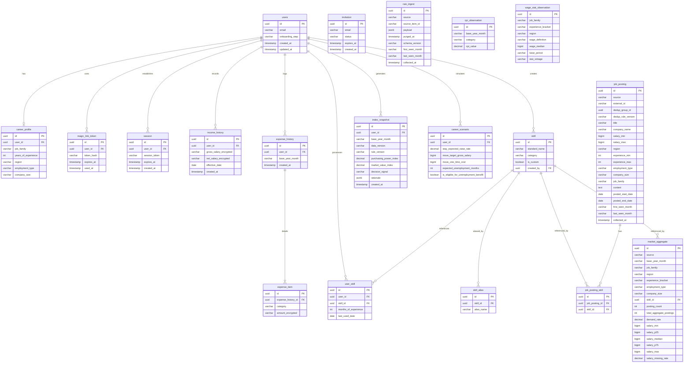

# Carix 데이터베이스 ERD (Entity-Relationship Diagram)

이 문서는 Carix 데이터베이스의 테이블 간 관계 및 각 테이블의 엔티티 구조를 시각화한 ERD입니다.

```mermaid
erDiagram
    users ||--o| career_profile : has
    users ||--o{ magic_link_token : uses
    users ||--o{ session : establishes
    users ||--o{ income_history : records
    users ||--o{ expense_history : logs
    users ||--o{ user_skill : possesses
    users ||--o{ skill : creates
    users ||--o{ index_snapshot : generates
    users ||--o{ career_scenario : simulates

    expense_history ||--|{ expense_item : details

    skill ||--o{ skill_alias : aliased_by
    skill ||--o{ user_skill : references
    skill ||--o{ job_posting_skill : referenced_by
    skill ||--o{ market_aggregate : referenced_by

    job_posting ||--o{ job_posting_skill : has

    users {
        uuid id PK
        varchar email
        varchar onboarding_step
        timestamp created_at
        timestamp updated_at
    }

    invitation {
        uuid id PK
        varchar email
        varchar status
        timestamp expires_at
        timestamp created_at
    }

    magic_link_token {
        uuid id PK
        uuid user_id FK
        varchar token_hash
        timestamp expires_at
        timestamp used_at
    }

    session {
        uuid id PK
        uuid user_id FK
        varchar session_token
        timestamp expires_at
        timestamp created_at
    }

    career_profile {
        uuid id PK
        uuid user_id FK
        varchar job_family
        int years_of_experience
        varchar region
        varchar employment_type
        varchar company_size
    }

    income_history {
        uuid id PK
        uuid user_id FK
        varchar gross_salary_encrypted
        varchar net_salary_encrypted
        date effective_date
        timestamp created_at
    }

    expense_history {
        uuid id PK
        uuid user_id FK
        varchar base_year_month
        timestamp created_at
    }

    expense_item {
        uuid id PK
        uuid expense_history_id FK
        varchar category
        varchar amount_encrypted
    }

    skill {
        uuid id PK
        varchar standard_name
        varchar category
        boolean is_custom
        uuid created_by FK
    }

    skill_alias {
        uuid id PK
        uuid skill_id FK
        varchar alias_name
    }

    user_skill {
        uuid id PK
        uuid user_id FK
        uuid skill_id FK
        int months_of_experience
        date last_used_date
    }

    raw_ingest {
        uuid id PK
        varchar source
        varchar source_item_id
        jsonb payload
        timestamp purged_at
        varchar schema_version
        varchar first_seen_month
        varchar last_seen_month
        timestamp collected_at
    }

    cpi_observation {
        uuid id PK
        varchar base_year_month
        varchar category
        decimal cpi_value
    }

    wage_stat_observation {
        uuid id PK
        varchar job_family
        varchar experience_bracket
        varchar region
        varchar wage_definition
        bigint wage_median
        varchar base_period
        varchar stat_vintage
    }

    job_posting {
        uuid id PK
        varchar source
        varchar external_id
        uuid dedup_group_id
        varchar dedup_rule_version
        varchar title
        varchar company_name
        bigint salary_min
        bigint salary_max
        varchar region
        int experience_min
        int experience_max
        varchar employment_type
        varchar company_size
        varchar job_family
        text content
        date posted_start_date
        date posted_end_date
        varchar first_seen_month
        varchar last_seen_month
        timestamp collected_at
    }

    job_posting_skill {
        uuid id PK
        uuid job_posting_id FK
        uuid skill_id FK
    }

    market_aggregate {
        uuid id PK
        varchar source
        varchar base_year_month
        varchar job_family
        varchar region
        varchar experience_bracket
        varchar employment_type
        varchar company_size
        uuid skill_id FK
        int posting_count
        int total_aggregate_postings
        decimal demand_rate
        bigint salary_min
        bigint salary_p25
        bigint salary_median
        bigint salary_p75
        bigint salary_max
        decimal salary_missing_rate
    }

    index_snapshot {
        uuid id PK
        uuid user_id FK
        varchar base_year_month
        varchar data_version
        varchar rule_version
        decimal purchasing_power_index
        decimal market_value_index
        varchar decision_signal
        jsonb rationale
        timestamp created_at
    }

    career_scenario {
        uuid id PK
        uuid user_id FK
        decimal stay_expected_raise_rate
        bigint move_target_gross_salary
        bigint move_one_time_cost
        int expected_unemployment_months
        boolean is_eligible_for_unemployment_benefit
    }
```
